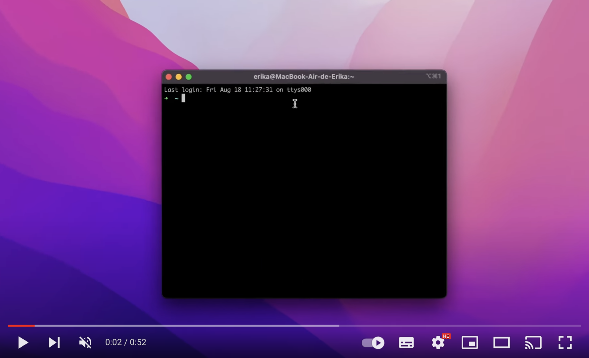
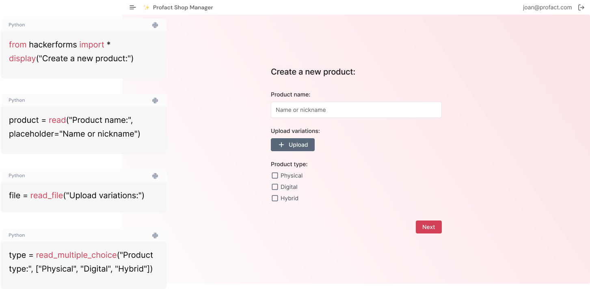

[](https://pypi.python.org/pypi/abstra)
[](https://pypi.org/project/abstra/)

# ✨ Abstra ✨

Abstra is a simple way to build business processes in Python, with no engineering overhead and complexity.

It's a powerful backoffice engine with:

- drag'n drop workflow builder
- dynamic forms
- serveless endpoints
- script schedulers
- zero-config authentication
- one-click scalable deploy
- cloud managed database
- plug'n play api integrations
- automatic audit logging
- access control

and much more! ⚡️

## 🚦 Getting started

[](https://youtu.be/kkTRU8PS8cg)

This package is compatible with Python >= 3.8

To install, run the following:

```
pip install abstra
```

Run the CLI server in the directory where you'd like to create your Abstra project. This can be any folder:

```
abstra serve ./your-project-directory
```

## 🧩 Workflow builder for Python


Use Workflows to automate processes that require a mix of manual steps and integrations between systems.

A Workflow is made up of Python-coded steps, which are then assembled visually in the editor. All steps share an environment, and can share variables and functions.


## 📝 Scriptable forms

Forms are Python scripts that allow for user interaction. They are the quickest way to build interactive UIs on the web.

With a Form, you can collect user input and use Python code to work with that information however you need. Some examples are making calculations with specialized libs, generating documents and graphs, and sending it to other systems via Requests.



## 🛟 Useful links

[Website](https://abstra.io) | [Docs](https://docs.abstra.io) | [Cloud](https://cloud.abstra.io) | [Youtube](https://www.youtube.com/playlist?list=PLFPJgKA6K86ZdAHZ3aPWsrZHX_7jJ3Cc9) | [Privacy]([./PRIVACY.md](https://www.abstra.io/privacy-policy))
