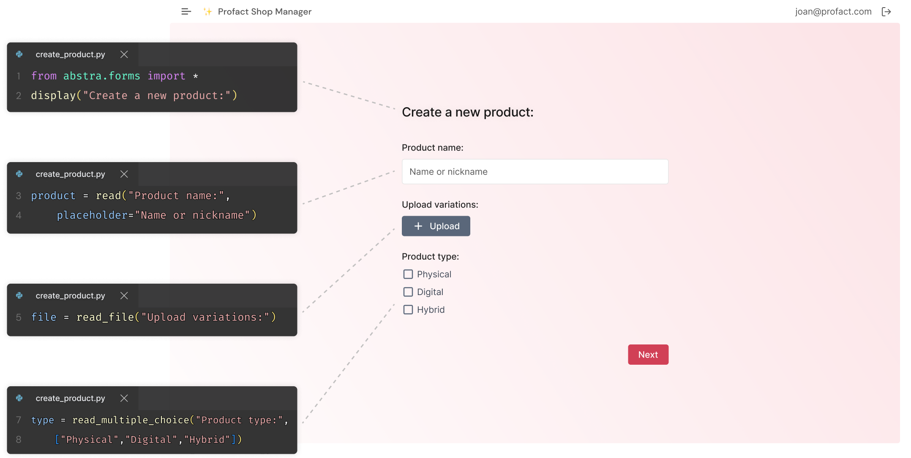

[](https://pypi.python.org/pypi/abstra)
[](https://pypi.org/project/abstra/)
[](https://github.com/abstra-app/abstra-lib/actions/workflows/code_check.yml)
# ✨ Abstra ✨

Abstra is the simplest way to build tools using Python.

It is a complete backoffice engine with:
- drag'n drop UI builders
- dynamic forms
- serveless endpoints
- script schedulers
- zero-config authentication
- one-click scalable deploy
- cloud managed database
- plug'n play api integrations
- automatic audit logging
- access control

and much more! 🤯

## 🧩 Drag'n drop app builder for Python.

Dashes is a drag'n drop UI builder that allows you to create customized UIs that interact with your Python variables and functions. This is perfect for creating dashboards, cockpits and admin panels.


## 📝 Scriptable forms

Forms is the quickest way to add transform Python scripts into interactive forms on the web. This is perfect for creating onboarding flows, calculators service order, and more.



## 🚦 Getting started

[](https://youtu.be/kkTRU8PS8cg)

This package is compatible with Python >= 3.7

```
pip install abstra --upgrade
```

Run the CLI server from any directory to edit your app

```
abstra serve ./your-app-directory
```

Deploy with a single command

```
abstra deploy ./your-app-directory
```

## 🛟 Useful link

[Site](https://abstra.io) | [Docs](https://docs.abstra.io) | [Cloud](https://cloud.abstra.io) | [Privacy](./PRIVACY.md)