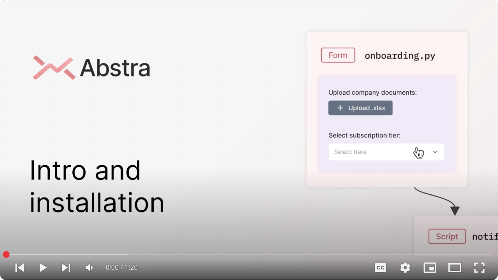
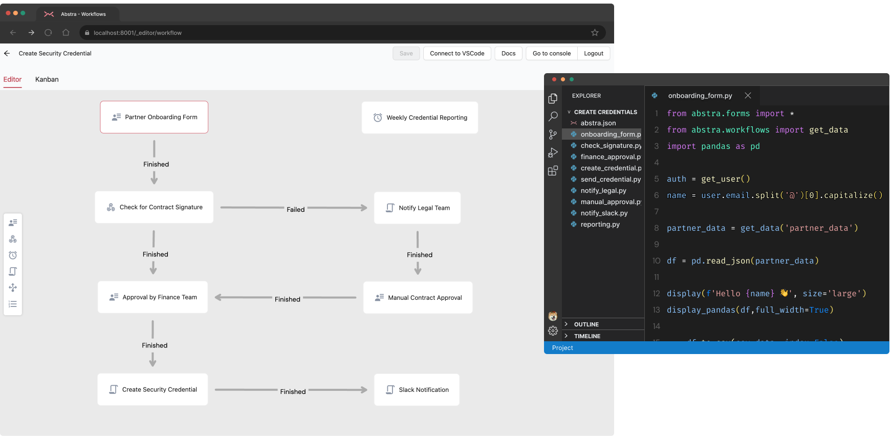

[](https://pypi.python.org/pypi/abstra)
[](https://pypi.org/project/abstra/)
[](https://github.com/abstra-app/abstra-lib/actions/workflows/code_check.yml)
# ✨ Abstra ✨

Abstra is a simple and powerful way to build business automation workflows.

It's a Python-powered backoffice engine with:
- drag'n drop workflow builder
- dynamic forms
- serveless endpoints
- script schedulers
- zero-config authentication
- one-click scalable deploy
- cloud managed database
- plug'n play api integrations
- automatic audit logging
- access control

and much more! ⚡️

## 🚦 Getting started

[](https://youtu.be/kkTRU8PS8cg)

This package is compatible with Python >= 3.7

To install, run the following:

```
pip install abstra
```

Run the CLI server in the directory where you'd like to create your Abstra project. This can be any folder: 

```
abstra serve ./your-project-directory
```

## 🧩 Workflow builder for Python

Workflows is perfect for automating repetitive processes that require a mix of manual steps and integration between systems.

Visually assemble a process made up of Python-coded steps. All steps share an environment, variables and functions.



## 📝 Scriptable forms

Forms is the quickest way to build interactive user interfaces on the web. Use it to get user input during your Workflow's run, such a request approval or additional data.

Manipulate this input with Python and any desired lib before moving to the next step.


## 🛟 Useful links

[Website](https://abstra.io) | [Docs](https://docs.abstra.io) | [Cloud](https://cloud.abstra.io) | [Privacy](./PRIVACY.md)